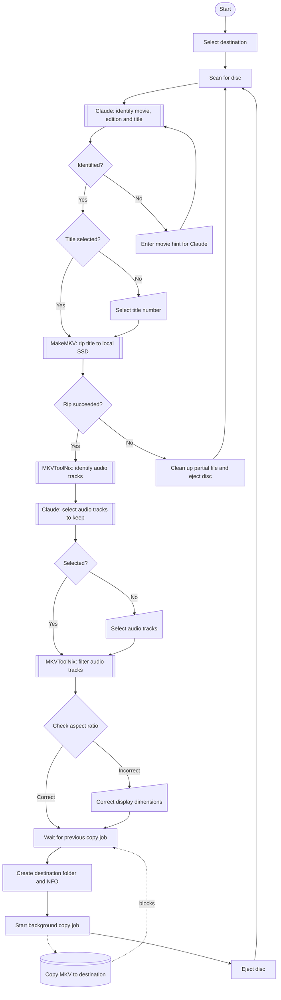

# Rip MKV using Claude

A PowerShell script that rips Blu-ray discs to MKV, intelligently selects the correct title and audio tracks using the Claude API, and copies the result to any destination folder. Supports back-to-back ripping — ejects each disc when done and waits for the next one automatically.

## Features

- **Automatic movie identification** – reads disc metadata, volume label, BDMV XML and cover thumbnails; uses Claude to identify the correct movie name and year matching [TMDB](https://www.themoviedb.org/)
- **Edition detection** – Claude identifies special cuts (Director's Cut, Extended Edition, etc.) and writes the result to the NFO
- **Intelligent title selection** – Claude picks the main feature based on runtime, file size, chapter count and resolution
- **Smart audio filtering** – Claude selects audio tracks based on configured preferred languages and audio quality
- **Native language preservation** – always keeps the film's original language even if not in the preferred list
- **Aspect ratio check** – detects broken display dimensions (e.g. 1:1 square video) and prompts for correction
- **Local SSD temp storage** – rips to a local SSD first before copying to the destination, avoiding slow network write speeds
- **Multi-disc loop** – ejects the disc after ripping and waits for the next one; exits if the same disc is re-inserted
- **Background copy** – copies the finished MKV to the destination in the background while the next disc is already being ripped
- **Audible alert** – optional double beep when manual input is required
- **NFO source tag** – writes a minimal NFO for media managers like tinyMediaManager

## Requirements

- [MakeMKV](https://www.makemkv.com/) (tested with v1.18.3)
- [MKVToolNix](https://mkvtoolnix.download/) (tested with v88.0)
- PowerShell 5.1 or later
- [Anthropic API key](https://console.anthropic.com/)

## Setup

1. Clone or download this repository
2. Copy `config.example.ps1` to `config.ps1`
3. Fill in your values:

```powershell
$claudeApiKey            = "sk-ant-YOUR_KEY_HERE"
$localTemp               = "C:\TempDir"
$defaultDestRoots        = @("C:\Movies", "D:\Movies")
$preferredAudioLanguages = @("eng", "swe")
$beepOnManualInput       = $true
$makemkvcon              = "C:\Program Files (x86)\MakeMKV\makemkvcon.exe"
$mkvmerge                = "C:\Program Files\MKVToolNix\mkvmerge.exe"
$mkvpropedit             = "C:\Program Files\MKVToolNix\mkvpropedit.exe"
```

> **Important:** Never commit `config.ps1` – it contains your API key. It is listed in `.gitignore`.

### Destination folders

`$defaultDestRoots` is an array of destination paths:
- **One entry** – used automatically without prompting
- **Multiple entries** – an arrow key menu is shown at startup; press Enter to confirm
- **Empty** – script exits with an error

> **Tip:** If your destination is a NAS, mount it as a network drive and add the drive letter to `$defaultDestRoots`. The script rips to local SSD first to avoid slow network writes during the MakeMKV step.

## Usage

1. Run the script from PowerShell:
```powershell
& '.\Rip MKV using Claude.ps1'
```
2. Select the destination folder if multiple are configured
3. Insert the first Blu-ray disc — the script waits for it automatically
4. The script runs automatically – Claude identifies the movie, selects the best title and filters audio tracks
5. If Claude cannot determine something with confidence you are prompted to select manually
6. When done, the disc is ejected and the script waits for the next one

## Workflow



## Audio selection rules

Claude applies these rules when selecting audio tracks:

1. Keep the highest quality format available (TrueHD or DTS-HD MA preferred over DTS or AC-3)
2. Keep tracks in preferred languages (configured in `config.ps1`)
3. Keep the film's original/native language even if not in preferred list
4. If duplicate language + quality level exists, keep all (may be different mixes e.g. theatrical vs. director's cut)

## Output

Movies are saved as:
```
<destRoot>\Movie Name (Year)\Movie Name (Year).mkv
<destRoot>\Movie Name (Year)\Movie Name (Year).nfo
```

The NFO contains the source (`Blu-ray`) and edition if detected (e.g. `Director's Cut`).

Compatible with [tinyMediaManager](https://www.tinymediamanager.org/) and media players like Zidoo that use NFO metadata.

## Notes

- **MPEG-2 aspect ratio bug** – MakeMKV sometimes sets incorrect display dimensions for MPEG-2 video. The script detects near 1:1 aspect ratios and prompts you to pick the correct one.
- **Rip failure** – if MakeMKV fails mid-rip, the partial file is removed, the disc is ejected, and you are prompted to retry (after cleaning the disc) or skip to the next disc.
- **BD-Java warning** – some discs require Java for menus. This does not affect ripping and can be ignored.
- **API cost** – each rip uses approximately 2 Claude API calls (name+edition+title combined, then audio). At current Sonnet pricing this costs a fraction of a cent per disc.

## License

MIT
