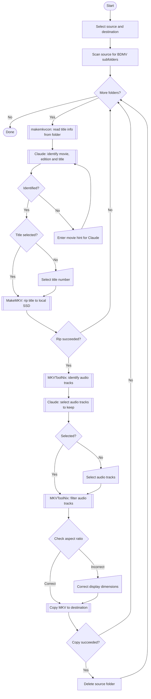

# Rip MKV using Claude

Two PowerShell scripts for ripping Blu-ray content to MKV. Both use the Claude API to identify movies, select the best title and filter audio tracks. Shared logic lives in `common.ps1` which is dot-sourced by both scripts.

| Script | Source |
|---|---|
| `Rip MKV using Claude.ps1` | Physical disc in a drive |
| `Rip MKV from Folder.ps1` | Pre-ripped BDMV folder tree |

## Features

- **Automatic movie identification** – reads disc metadata, volume label, BDMV XML and cover thumbnails; uses Claude to identify the correct movie name and year matching [TMDB](https://www.themoviedb.org/)
- **Edition detection** – Claude identifies special cuts (Director's Cut, Extended Edition, etc.) and writes the result to the NFO
- **Intelligent title selection** – Claude picks the main feature based on runtime, file size, chapter count and resolution
- **Smart audio filtering** – Claude selects audio tracks based on configured preferred languages and audio quality
- **Native language preservation** – always keeps the film's original language even if not in the preferred list
- **Aspect ratio check** – detects broken display dimensions (e.g. 1:1 square video) and prompts for correction
- **Local SSD temp storage** – rips to a local SSD first before copying to the destination, avoiding slow network write speeds
- **Background copy** – disc script only: copies the finished MKV to the destination in the background while the next disc is being ripped
- **Audible alert** – optional double beep when manual input is required
- **NFO source tag** – writes a minimal NFO for media managers like tinyMediaManager

## Requirements

- [MakeMKV](https://www.makemkv.com/) (tested with v1.18.3)
- [MKVToolNix](https://mkvtoolnix.download/) (tested with v88.0)
- PowerShell 5.1 or later
- [Anthropic API key](https://console.anthropic.com/)

## Setup

1. Clone or download this repository
2. Copy `config.example.ps1` to `config.ps1`
3. Fill in your values:

```powershell
$claudeApiKey            = "sk-ant-YOUR_KEY_HERE"
$localTemp               = "C:\TempDir"
$defaultDestRoots        = @("C:\Movies", "D:\Movies")
$preferredAudioLanguages = @("eng", "swe")
$beepOnManualInput       = $true
$makemkvcon              = "C:\Program Files (x86)\MakeMKV\makemkvcon.exe"
$mkvmerge                = "C:\Program Files\MKVToolNix\mkvmerge.exe"
$mkvpropedit             = "C:\Program Files\MKVToolNix\mkvpropedit.exe"
```

> **Important:** Never commit `config.ps1` – it contains your API key. It is listed in `.gitignore`.

### Destination folders

`$defaultDestRoots` is an array of destination paths. At startup an arrow key menu shows all configured destinations plus an **Other...** option for entering a custom path. Script exits with an error if the array is empty.

> **Tip:** If your destination is a NAS, mount it as a network drive and add the drive letter to `$defaultDestRoots`. The script rips to local SSD first to avoid slow network writes during the MakeMKV step.

### Source folder (folder script only)

The source folder is entered manually each time the script starts. Each immediate subfolder of the entered path that contains a `BDMV\` directory is treated as one disc to process.

## Usage

### Disc script

1. Run the script from PowerShell:
```powershell
& '.\Rip MKV using Claude.ps1'
```
2. Select the destination folder if multiple are configured
3. Insert the first Blu-ray disc — the script waits for it automatically
4. The script runs automatically – Claude identifies the movie, selects the best title and filters audio tracks
5. If Claude cannot determine something with confidence you are prompted to select manually
6. When done, the disc is ejected and the script waits for the next one

### Folder script

1. Run the script from PowerShell:
```powershell
& '.\Rip MKV from Folder.ps1'
```
2. Enter the source folder path when prompted, then select a destination
3. The script processes each BDMV subfolder in order — Claude identifies the movie, selects the best title and filters audio tracks
4. Each source folder is deleted after its MKV has been successfully copied to the destination
5. If a copy fails the source folder is left intact

## Workflow

### Disc script


### Folder script



## Audio selection rules

Claude applies these rules when selecting audio tracks:

1. Keep the highest quality format available (TrueHD or DTS-HD MA preferred over DTS or AC-3)
2. Keep tracks in preferred languages (configured in `config.ps1`)
3. Keep the film's original/native language even if not in preferred list
4. If duplicate language + quality level exists, keep all (may be different mixes e.g. theatrical vs. director's cut)

## Output

Movies are saved as:
```
<destRoot>\Movie Name (Year)\Movie Name (Year).mkv
<destRoot>\Movie Name (Year)\Movie Name (Year).nfo
```

The NFO contains the source (`Blu-ray`) and edition if detected (e.g. `Director's Cut`).

Compatible with [tinyMediaManager](https://www.tinymediamanager.org/) and media players like Zidoo that use NFO metadata.

## Notes

- **MPEG-2 aspect ratio bug** – MakeMKV sometimes sets incorrect display dimensions for MPEG-2 video. The script detects near 1:1 aspect ratios and prompts you to pick the correct one.
- **Rip failure (disc)** – if MakeMKV fails mid-rip, the partial file is removed, the disc is ejected, and you are prompted to retry (after cleaning the disc) or skip to the next disc.
- **Rip failure (folder)** – if MakeMKV fails, the partial file is removed and the script skips to the next folder.
- **BD-Java warning** – some discs require Java for menus. This does not affect ripping and can be ignored.
- **API cost** – each rip uses approximately 2 Claude API calls (name+edition+title combined, then audio). At current Sonnet pricing this costs a fraction of a cent per disc.

## License

MIT
