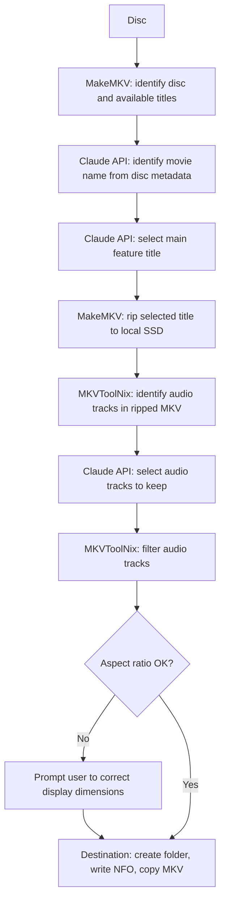

# Rip MKV using Claude

A PowerShell script that rips a Blu-ray disc to MKV, intelligently selects the correct title and audio tracks using the Claude API, and copies the result to any destination folder.

## Features

- **Automatic movie identification** – reads disc metadata and uses Claude to identify the correct movie name and year matching [TMDB](https://www.themoviedb.org/)
- **Intelligent title selection** – Claude picks the main feature based on runtime, file size, chapter count and resolution
- **Smart audio filtering** – Claude selects audio tracks based on configured preferred languages and audio quality
- **Native language preservation** – always keeps the film's original language even if not in the preferred list
- **Aspect ratio check** – detects broken display dimensions (e.g. 1:1 square video) and prompts for correction
- **Local SSD temp storage** – rips to a local SSD first before copying to the destination, avoiding slow network write speeds
- **NFO source tag** – writes a minimal NFO for media managers like tinyMediaManager

## Requirements

- [MakeMKV](https://www.makemkv.com/) (tested with v1.18.3)
- [MKVToolNix](https://mkvtoolnix.download/) (tested with v88.0)
- PowerShell 5.1 or later
- [Anthropic API key](https://console.anthropic.com/)

## Setup

1. Clone or download this repository
2. Copy `config.example.ps1` to `config.ps1`
3. Fill in your values:

```powershell
$claudeApiKey            = "sk-ant-YOUR_KEY_HERE"
$localTemp               = "C:\TempDir"
$defaultDestRoots        = @("C:\Movies", "D:\Movies")
$preferredAudioLanguages = @("eng", "swe")
$makemkvcon              = "C:\Program Files (x86)\MakeMKV\makemkvcon.exe"
$mkvmerge                = "C:\Program Files\MKVToolNix\mkvmerge.exe"
$mkvpropedit             = "C:\Program Files\MKVToolNix\mkvpropedit.exe"
```

> **Important:** Never commit `config.ps1` – it contains your API key. It is listed in `.gitignore`.

## Usage

1. Insert the Blu-ray disc
2. Run the script from PowerShell:
```powershell
& '.\Rip MKV using Claude.ps1'
```
3. Confirm or enter the destination folder (default from config)
4. The script runs automatically from here – Claude identifies the movie, selects the best title and filters audio tracks
5. If Claude cannot determine something with confidence you are prompted to select manually

## Workflow



## Audio selection rules

Claude applies these rules when selecting audio tracks:

1. Keep the highest quality format available (TrueHD or DTS-HD MA preferred over DTS or AC-3)
2. Keep tracks in preferred languages (configured in `config.ps1`)
3. Keep the film's original/native language even if not in preferred list
4. If duplicate language + quality level exists, keep all (may be different mixes e.g. theatrical vs. director's cut)

## Output

Movies are saved as:
```
<destRoot>\Movie Name (Year)\Movie Name (Year).mkv
<destRoot>\Movie Name (Year)\Movie Name (Year).nfo
```

Compatible with [tinyMediaManager](https://www.tinymediamanager.org/) and media players like Zidoo that use NFO metadata.

> **Tip:** If your destination is a NAS, mount it as a network drive and set `$defaultDestRoot` to that drive letter. The script rips to local SSD first to avoid slow network writes during the MakeMKV step.

## Notes

- **MPEG-2 aspect ratio bug** – MakeMKV sometimes sets incorrect display dimensions for MPEG-2 video. The script detects near 1:1 aspect ratios and prompts you to pick the correct one.
- **BD-Java warning** – some discs require Java for menus. This does not affect ripping and can be ignored.
- **API cost** – each rip uses approximately 3 Claude API calls (name, title, audio). At current Sonnet pricing this costs a fraction of a cent per disc.

## License

MIT
